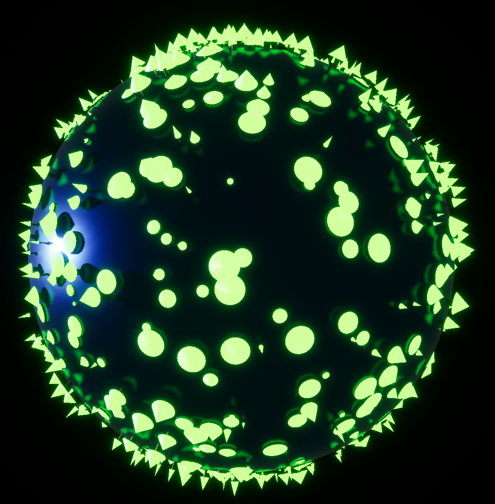

# trees
Unreal Engine Tree Generator

## Description
This is a small utility to create random trees around a spherical planet. Trees can be randomly generated via the UI. Trees can also be deleted by right-clicking on a tree.

## Features
* Generation of random trees on a spherical planet, where sizes are all relative to the planetary radius
* Dynamic deletion of trees by right-clicking
* Disabling invisible trees to improve runtime at high tree counts

## Basic Controls
| Command      | Description |
| ----------- | ----------- |
| `Left Click` + `Drag`      | Rotate around the planet       |
| `Scrollwheel`   | Zoom in and out        |
| `Right Click`   | Remove a tree       |

